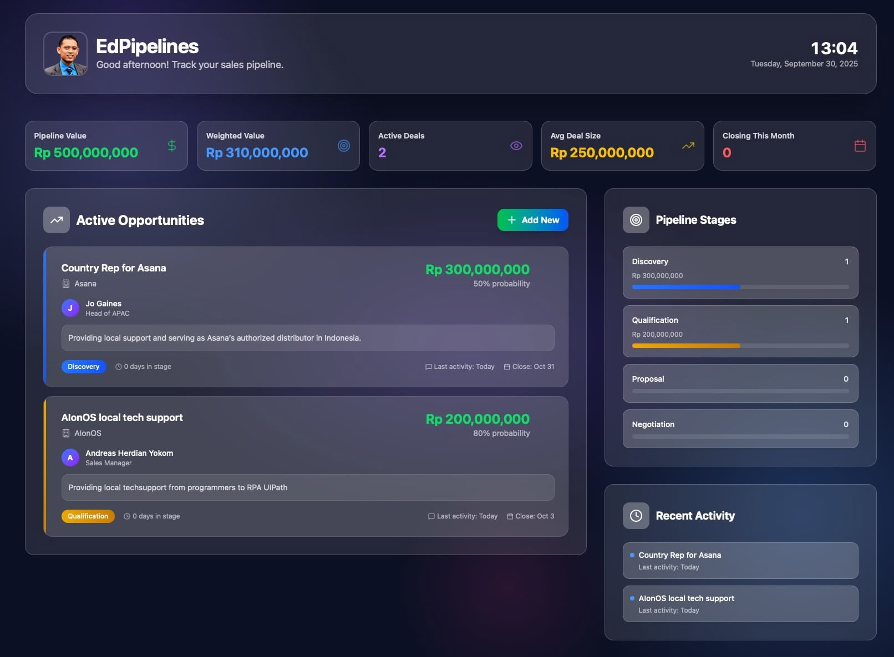

# Pipelines - Deal Tracking

A sales pipeline management application that helps teams move opportunities from first contact to closed‑won. It combines clear pipeline management with a visual interface where each stage reflects a step in your sales process, giving instant clarity on what's active, stuck, or ready to close.



## Features

- Create and manage pipeline opportunities
- Track deals through different stages (Discovery, Qualification, Proposal, Negotiation)
- Manage deal values, probabilities, and expected close dates
- Contact management integration
- Beautiful glassmorphic UI with dark theme
- Custom date picker with quick actions
- Responsive design

## Technologies

### SvelteKit Version (Development)
- SvelteKit + TypeScript
- TailwindCSS
- SQLite (better-sqlite3)
- Lucide Icons

### PHP Version (Hostinger Deployment)
- PHP 7.4+
- SQLite3
- Bootstrap 5
- Vanilla JavaScript

## Getting Started

### SvelteKit Development Version

**Prerequisites:** Node.js 18+, npm or pnpm

```bash
npm install
npm run dev
```

### PHP Production Version (Hostinger)

Upload the `public_html` directory to your Hostinger hosting. The SQLite database will be created automatically on first run.

## License

MIT
